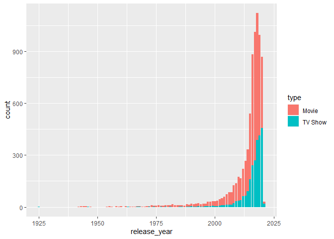
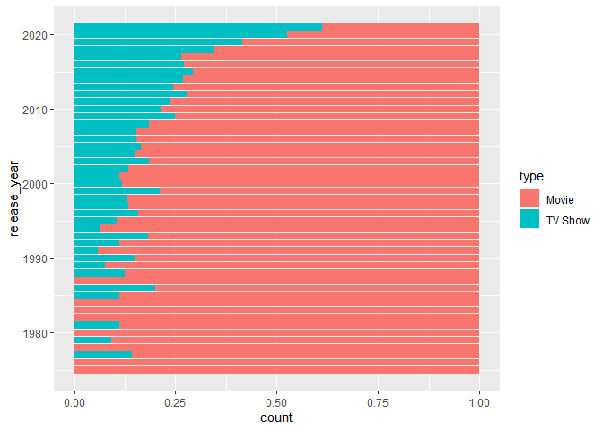
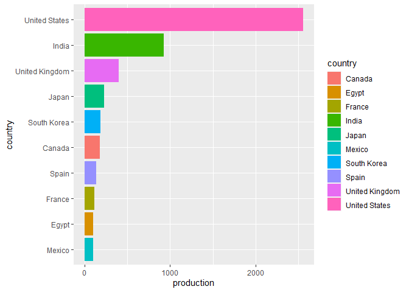
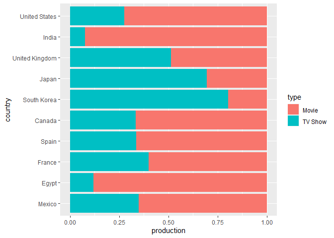

Netflix
================
Fanyi Zeng
2022-05-03

``` r
netflix_titles <- readr::read_csv('https://raw.githubusercontent.com/rfordatascience/tidytuesday/master/data/2021/2021-04-20/netflix_titles.csv')
```

    ## Rows: 7787 Columns: 12

    ## -- Column specification --------------------------------------------------------
    ## Delimiter: ","
    ## chr (11): show_id, type, title, director, cast, country, date_added, rating,...
    ## dbl  (1): release_year

    ## 
    ## i Use `spec()` to retrieve the full column specification for this data.
    ## i Specify the column types or set `show_col_types = FALSE` to quiet this message.

``` r
library(tidyverse)
```

    ## -- Attaching packages --------------------------------------- tidyverse 1.3.1 --

    ## v ggplot2 3.3.5     v purrr   0.3.4
    ## v tibble  3.1.6     v dplyr   1.0.7
    ## v tidyr   1.1.4     v stringr 1.4.0
    ## v readr   2.1.1     v forcats 0.5.1

    ## -- Conflicts ------------------------------------------ tidyverse_conflicts() --
    ## x dplyr::filter() masks stats::filter()
    ## x dplyr::lag()    masks stats::lag()

Let’s take a look at the trend of movies and tv shows. We can see that
both movies and TV shows are increasing. Since 2020, however, there is a
sudden drop in production due to the COVID pandemic.

``` r
netflix_titles %>%
  ggplot(aes(x=release_year, fill=type)) +
  geom_bar()
```

<!-- -->

Although historically movies have been more dominant than TV shows, in
recent years Netflix seems to focus more on TV shows.

``` r
netflix_titles %>%
  filter(release_year >= 1975) %>%
  ggplot(aes(y=release_year, fill=type)) +
  geom_bar(position="fill")
```

<!-- -->

What are the most prolific countries? Below are the top 10. US is
followed by India and UK.

``` r
Top10 <- netflix_titles %>%
  filter(country!="NA") %>%
  count(country) %>%
  arrange(desc(n)) %>%
  slice(1:10) 
Top10 %>%
  ggplot(aes(y=reorder(country,n),x=n,fill=country)) +
  geom_col() +
  labs(y="country",x="production")
```

<!-- -->

Breaking up into types, Japan and South Korea have significantly more TV
shows than movies. UK is about half and half. Other countries have
significantly more movies than TV shows, with India the most prominent
followed by Egypt. Another analytic article suggests that this might be
the result of market research that Netflix did in different countries.
e.g., India has a renown film industry (Bollywood).

``` r
netflix_titles %>%
  filter(country == "United States" | country == "India" | country == "United Kingdom" | country == "Japan" | country == "South Korea" | country == "Canada" | country == "Spain" | country == "France" | country == "Egypt" | country == "Mexico") %>%
  ggplot(aes(y=factor(country,level=c("United States", "India", "United Kingdom", "Japan", "South Korea", "Canada", "Spain", "France", "Egypt", "Mexico")),fill=type)) +
  geom_bar(position="fill") +
  labs(y="country",x="production") +
  scale_y_discrete(limits=rev)
```

<!-- -->

This is a very interesting dataset! I have learned more about Netflix’s
production in different parts of the world.
